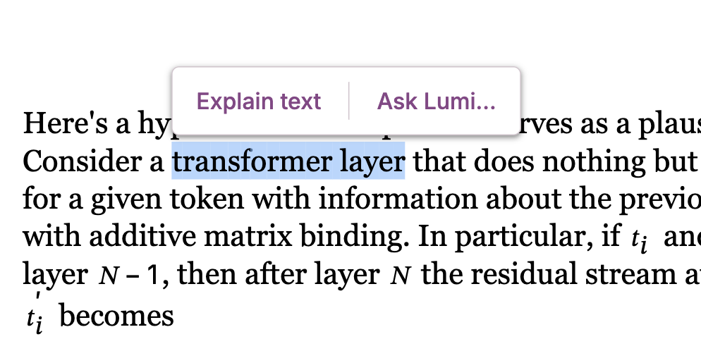
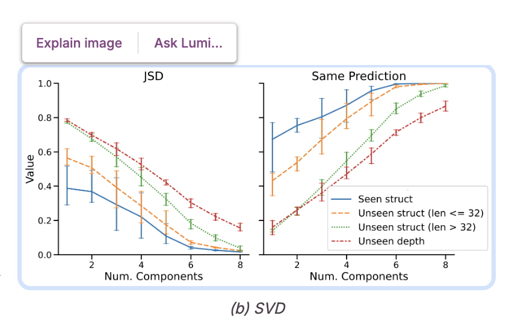

# Welcome to Lumi

[Lumi](https://lumi.withgoogle.com) is a web app with AI-powered features to help you quickly read and understand [arXiv](https://arxiv.org/) papers. Features include:

- ✏️ **AI-augmented annotations** - read summaries at multiple granularities
- 🔖 **Smart highlights** - highlight text + ask questions
- 🖼️ **Explain figures** - ask Lumi about images in the paper


## Using Lumi

Lumi is available as an experimental demo at [https://lumi.withgoogle.com](lumi.withgoogle.com)! Try it out and [share feedback + feature requests in our Discussions tab](https://github.com/PAIR-code/lumi/discussions).

Please note that Lumi can only currently process arXiv papers under a Creative Commons license.

**Tip: Ask Lumi questions**

Select text or click an image to ask Lumi questions:

|  |  |
| :--------------------------------------------------------------------------------: | :------------------------------------------------------------------------------------------: |

## Running Lumi locally

### Set up Firebase functions and emulators

Follow instructions in
[`functions/README.md`](https://github.com/PAIR-code/lumi/tree/main/functions)
to install relevant dependencies and run local emulators.

### Start frontend web app

```bash
cd frontend  # If navigating from top level
npm install  # Only run once

# Create an index.html file and (optionally) replace the placeholder
# analytics ID (see TODOs in example file) with your Google Analytics ID
cp index.example.html index.html

# Create a firebase_config.ts file and replace the placeholder.
cp firebase_config.example.ts firebase_config.ts

npm run start
```

Then, view the app at http://localhost:4201.

### Storybook stories

To view [Storybook](https://storybook.js.org/docs) stories for Lumi:

```
npm run storybook
```

Then, view the stories at http://localhost:6006.

### Local paper import and debugging

The import script in `scripts/import_papers_local.py` can be used to import a
set of papers for local debugging.

The locally imported papers can be rendered in `lumi_doc.stories.ts`
via Storybook.

## Deploying the Lumi app

To deploy the web app via App Engine, add an
[app.yaml](https://cloud.google.com/appengine/docs/standard/reference/app-yaml?tab=node.js)
configuration and
[set your Google Cloud project](https://cloud.google.com/sdk/gcloud/reference/config/set).

```bash
npm run deploy:prod
```

To deploy the Firebase cloud functions, see functions/README.md.

## License and Disclaimer

All software is licensed under the Apache License, Version 2.0 (Apache 2.0).
You may not use this file except in compliance with the Apache 2.0 license.
You may obtain a copy of the Apache 2.0 license at:
https://www.apache.org/licenses/LICENSE-2.0.

Unless required by applicable law or agreed to in writing, all software and
materials distributed here under the Apache 2.0 licenses are distributed on an
"AS IS" BASIS, WITHOUT WARRANTIES OR CONDITIONS OF ANY KIND, either express or
implied. See the licenses for the specific language governing permissions and
limitations under those licenses.

This is not an official Google product.

Lumi is a research project under active development by a small
team. If you have suggestions or feedback, feel free to
[submit an issue](https://github.com/pair-code/lumi/issues).

Copyright 2025 DeepMind Technologies Limited.

## Acknowledgments

Lumi was designed and built by Ellen Jiang, Vivian Tsai, and Nada Hussein.

Special thanks to Andy Coenen, James Wexler, Tianchang He, Mahima Pushkarna, Michael Xieyang Liu, Alejandra Molina, Aaron Donsbach, Martin Wattenberg, Fernanda Viégas, Michael Terry, and Lucas Dixon for making this experiment possible!
