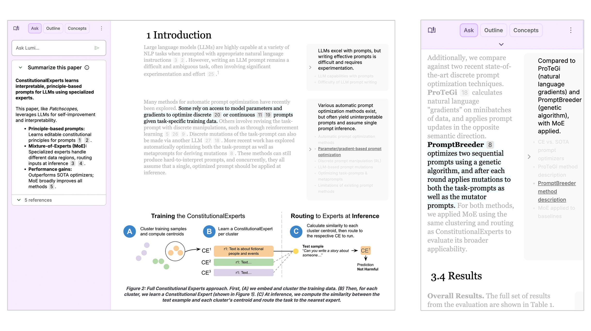

# 欢迎使用 Lumi

[Lumi](https://lumi.withgoogle.com) 借助 AI 帮助你快速阅读并理解 [arXiv 论文](https://arxiv.org/)，目前支持 Creative Commons 许可的论文。

## 核心功能
- ✏️ AI 增强标注：多粒度摘要与重点提示
- 🔖 智能高亮：选中段落即可提问
- 🖼️ 图像解读：针对论文图像获得说明

## 快速上手
1. 在 `functions/README.md` 内完成 Firebase 依赖与本地模拟器设置。
2. 进入 `frontend` 目录，运行 `npm install`，复制示例配置文件，并执行 `npm run start`。
3. 访问 http://localhost:4201 体验应用；如需 Storybook，运行 `npm run storybook` 并访问 http://localhost:6006。

更多部署与调试说明请详见英文版 `README.md`。

## 许可证
项目遵循 Apache License 2.0；详情请查阅 https://www.apache.org/licenses/LICENSE-2.0。

## 致谢
Lumi 由 Ellen Jiang、Vivian Tsai 和 Nada Hussein 设计与构建，并感谢众多合作者的支持。
